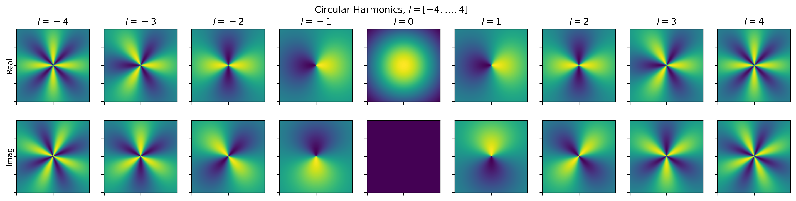
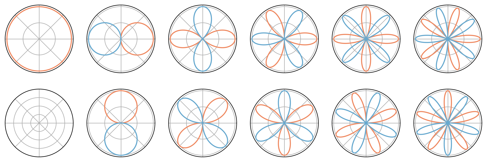

# Circular Harmonics

Visualizations of circular harmonics.

See also my [post on spherical harmonics](https://github.com/mkofinas/spherical-harmonics).

## Sources

- Circular Harmonics: Digging in circles, https://valdes.cc/articles/ch.html
- Harmonic Networks: Deep Translation and Rotation Equivariance, https://arxiv.org/abs/1612.04642
